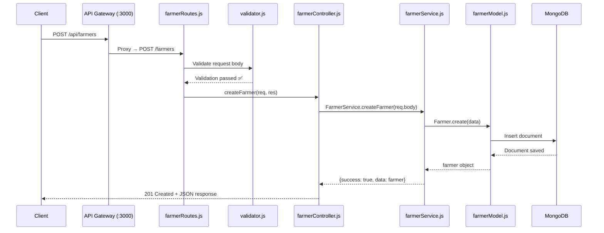

# 🌾 Viva Preparation — Farmer Service (Smart Agriculture System)

> **Your Component:** `farmer-service` | **Port:** `5001` | **Gateway Route:** `/api/farmers`

---

## 1. 🏗️ What is the Overall Project?

The **Smart Agriculture Supply Chain System** is a microservices-based backend that manages the agriculture supply chain — from **farm to table**. It is built using **Node.js + Express.js** with **MongoDB** as the database and an **API Gateway** that routes all client requests to the appropriate microservice.

### The 5 Microservices:

| Service | Port | Owner | Purpose |
|---------|------|-------|---------|
| **Farmer Service** | 5001 | **You** | Manages farmer registration & crop listings |
| **Buyer Service** | 5002 | Member 2 | Manages buyer registrations |
| **Marketplace Service** | 5003 | Member 3 | Handles product listings & orders |
| **Logistics Service** | 5004 | Member 4 | Manages deliveries & tracking |
| **Prediction Service** | 5005 | Member 5 | Simulates crop price predictions |

### Architecture Diagram:
```
                    ┌──────────────────────┐
        Client ───► │    API Gateway        │
                    │    Port: 3000         │
                    └───────┬──────────────┘
                            │
         ┌──────────────────┼──────────────────┐
         │                  │                  │
    ┌────▼────┐      ┌─────▼─────┐     ┌─────▼──────┐
    │ Farmer  │      │  Buyer    │     │Marketplace │
    │ Service │      │ Service   │     │  Service   │
    │ :5001   │      │ :5002     │     │  :5003     │
    └─────────┘      └───────────┘     └────────────┘
         │                                     │
    ┌────▼────────┐                   ┌────────▼────┐
    │ Logistics   │                   │ Prediction  │
    │  Service    │                   │  Service    │
    │  :5004      │                   │  :5005      │
    └─────────────┘                   └─────────────┘
                            │
                    ┌───────▼──────────────┐
                    │      MongoDB         │
                    │    Port: 27017       │
                    └──────────────────────┘
```

---

## 2. 🧑‍🌾 What Does the Farmer Service Do?

The Farmer Service is responsible for **managing farmer data** in the Smart Agriculture system. It provides a full **CRUD (Create, Read, Update, Delete) REST API** for farmer entities.

### Business Context:
- In our agriculture supply chain, **farmers are the producers** — they grow crops and supply them to the marketplace.
- Before a farmer can list products on the marketplace, they must **register** in the system through this service.
- This service stores farmer details including their **name, email, phone, location, and crops they grow**.
- Other services (marketplace, logistics) can reference farmer IDs to link products and deliveries back to specific farmers.

### What the Farmer Service Manages:
| Field | Type | Required | Description |
|-------|------|----------|-------------|
| `name` | String | ✅ Yes | Full name of the farmer |
| `email` | String | ✅ Yes | Email (must be unique) |
| `phone` | String | ❌ Optional | Phone number |
| `location` | String | ❌ Optional | Farming location (e.g., "Anuradhapura") |
| `crops` | Array of Strings | ❌ Optional | List of crops grown (e.g., ["Rice", "Maize"]) |
| `createdAt` | DateTime | Auto | Auto-generated timestamp |
| `updatedAt` | DateTime | Auto | Auto-updated timestamp |

---

## 3. 📂 Folder Structure of Farmer Service

```
farmer-service/
├── .dockerignore        # Files to exclude from Docker build
├── .env                 # Environment variables (PORT, NODE_ENV, SERVICE_NAME)
├── Dockerfile           # Docker container configuration
├── app.js               # Express app setup (middleware, swagger, routes)
├── server.js            # Entry point — connects to DB, starts server
├── package.json         # Dependencies & scripts
└── src/
    ├── config/
    │   ├── index.js     # Centralized configuration (reads .env)
    │   └── db.js        # MongoDB connection logic using Mongoose
    ├── controllers/
    │   └── farmerController.js  # Handles HTTP req/res, calls service layer
    ├── middleware/
    │   └── validator.js         # express-validator middleware
    ├── models/
    │   └── farmerModel.js       # Mongoose schema definition for Farmer
    ├── routes/
    │   └── farmerRoutes.js      # Route definitions + Swagger JSDoc annotations
    └── services/
        └── farmerService.js     # Business logic layer (DB operations)
```

> [!IMPORTANT]
> **This follows the MVC (Model-View-Controller) pattern + Service Layer pattern**, which separates:
> - **Model** → Data schema (what a farmer looks like)
> - **Controller** → HTTP handling (receives request, sends response)
> - **Service** → Business logic (actual DB operations)
> - **Routes** → URL mapping (which URL calls which controller)

---

## 4. 🔄 Request Flow (How a Request Travels Through the Code)



### Step-by-step:
1. **Client** sends `POST /api/farmers` to the **API Gateway** (port 3000)
2. **API Gateway** uses `http-proxy-middleware` to proxy the request to `http://farmer-service:5001/farmers`
3. **farmerRoutes.js** matches the `POST /` route
4. **express-validator** middleware validates the request body (name required, email must be valid, etc.)
5. **validator.js** checks if validation passed; if errors exist, returns `400 Bad Request`
6. **farmerController.js** receives the request and calls `FarmerService.createFarmer(req.body)`
7. **farmerService.js** uses the Mongoose model to insert the farmer into MongoDB
8. Response flows back through the chain with `201 Created` status

---

## 5. 📝 Code Walkthrough — File by File

### 5.1 `server.js` — Entry Point
```javascript
const app = require('./app');
const config = require('./src/config');
const connectDB = require('./src/config/db');

connectDB().then(() => {
  app.listen(config.port, () => {
    console.log(`👨‍🌾 [farmer-service] running on http://localhost:${config.port}`);
  });
});
```
**What it does:** Connects to MongoDB first, then starts the Express server. This ensures the DB is ready before accepting requests.

### 5.2 `app.js` — Express Application Setup
Key things configured here:
- **CORS** — Allows cross-origin requests (so the gateway/frontend can talk to this service)
- **Morgan** — HTTP request logger (logs every request to console in dev mode)
- **express.json()** — Parses incoming JSON request bodies
- **Swagger UI** — Serves interactive API docs at `/api-docs`
- **Health Check** — `GET /health` endpoint returns service status
- **Routes** — `app.use('/farmers', farmerRoutes)` mounts all farmer routes
- **404 Handler** — Catches unmatched routes
- **Global Error Handler** — Catches unhandled errors and returns 500

### 5.3 `src/config/index.js` — Configuration
```javascript
require('dotenv').config();
module.exports = {
  port: process.env.PORT || 5001,
  env: process.env.NODE_ENV || 'development',
  serviceName: process.env.SERVICE_NAME || 'farmer-service',
};
```
**Why:** Centralizes all configuration. Uses `dotenv` to read from `.env` file. Environment variables can be overridden by Docker/docker-compose.

### 5.4 `src/config/db.js` — Database Connection
```javascript
const mongoose = require('mongoose');
const connectDB = async () => {
  const conn = await mongoose.connect(
    process.env.MONGODB_URI || 'mongodb://localhost:27017/smart-agri-farmer'
  );
  console.log(`✅ MongoDB Connected: ${conn.connection.host}`);
};
```
**Key points:**
- Uses **Mongoose ODM** (Object Data Modeling) library to connect to MongoDB
- Connection URI comes from environment variable `MONGODB_URI`
- In Docker, this is `mongodb://mongodb:27017/smart-agri-farmers` (uses Docker service name `mongodb` as hostname)
- In local development, falls back to `localhost:27017`
- Exits process if connection fails (fail-fast pattern)

### 5.5 `src/models/farmerModel.js` — Mongoose Schema
```javascript
const farmerSchema = new mongoose.Schema({
  name:     { type: String, required: [true, 'Name is required'], trim: true },
  email:    { type: String, required: true, unique: true, lowercase: true,
              match: [/^[^\s@]+@[^\s@]+\.[^\s@]+$/, 'Invalid email format'] },
  phone:    { type: String, trim: true, default: null },
  location: { type: String, trim: true, default: null },
  crops:    { type: [String], default: [] }
}, { timestamps: true });
```
**Key design decisions:**
- **`unique: true` on email** — Prevents duplicate farmer registrations (MongoDB creates a unique index)
- **`timestamps: true`** — Mongoose automatically adds `createdAt` and `updatedAt` fields
- **`trim: true`** — Removes whitespace from inputs
- **`lowercase: true` on email** — Normalizes email to lowercase
- **Regex validation** on email — Validates email format at the schema level
- **`toJSON` transform** — Renames `_id` to `id` and removes `__v` (version key) for cleaner API responses

### 5.6 `src/services/farmerService.js` — Business Logic
This is a **static class** with 5 methods:

| Method | Purpose | Returns |
|--------|---------|---------|
| `getAllFarmers()` | Fetches all farmers from DB | `{ success, count, data }` |
| `getFarmerById(id)` | Fetches one farmer by MongoDB `_id` | `{ success, data }` or `{ success: false, error }` |
| `createFarmer(data)` | Inserts a new farmer | `{ success, message, data }` |
| `updateFarmer(id, data)` | Updates farmer using `findByIdAndUpdate` | `{ success, message, data }` |
| `deleteFarmer(id)` | Deletes farmer using `findByIdAndDelete` | `{ success, message, data }` |

**Error handling in the service:**
- **Duplicate email (error code 11000)** → Returns `{ success: false, errors: ['Email already exists'] }`
- **Validation error** → Extracts Mongoose validation messages and returns them
- **Other errors** → Re-throws to be caught by the controller

### 5.7 `src/controllers/farmerController.js` — HTTP Handlers
Each controller method:
1. Calls the corresponding service method
2. Checks `result.success` to determine the HTTP status code
3. Returns the appropriate JSON response
4. Wraps everything in try/catch for error handling

**HTTP Status Codes Used:**
| Status | Meaning | When Used |
|--------|---------|-----------|
| `200 OK` | Success | GET, PUT, DELETE success |
| `201 Created` | Resource created | POST success |
| `400 Bad Request` | Validation error | Invalid input |
| `404 Not Found` | Resource not found | ID doesn't exist |
| `500 Internal Server Error` | Server error | Unexpected errors |

### 5.8 `src/routes/farmerRoutes.js` — Route Definitions
Defines 5 API endpoints:

| Method | Endpoint | Handler | Validation |
|--------|----------|---------|------------|
| `GET` | `/farmers` | `getAllFarmers` | None |
| `GET` | `/farmers/:id` | `getFarmerById` | None |
| `POST` | `/farmers` | `createFarmer` | name (required), email (required, valid format), phone, location, crops |
| `PUT` | `/farmers/:id` | `updateFarmer` | All fields optional but validated if present |
| `DELETE` | `/farmers/:id` | `deleteFarmer` | None |

**Validation rules (using express-validator):**
- `name` → Must not be empty, is trimmed
- `email` → Must be a valid email format, normalized to lowercase
- `phone` → Optional, must be a string
- `location` → Optional, must be a string
- `crops` → Optional, must be an array

This file also contains **Swagger JSDoc annotations** (the `@swagger` comments) that auto-generate the API documentation.

### 5.9 `src/middleware/validator.js` — Validation Middleware
```javascript
const validate = (req, res, next) => {
  const errors = validationResult(req);
  if (!errors.isEmpty()) {
    return res.status(400).json({
      success: false,
      errors: errors.array().map(err => err.msg)
    });
  }
  next();
};
```
**What it does:** Checks if `express-validator` found any validation errors. If yes, returns `400` with error messages. If no errors, calls `next()` to proceed to the controller.

---

## 6. 🐳 Docker & Docker Compose

### Dockerfile:
```dockerfile
FROM node:18-alpine       # Lightweight Node.js base image
WORKDIR /usr/src/app      # Set working directory in container
COPY package*.json ./     # Copy package files first (for caching)
RUN npm install           # Install dependencies
COPY . .                  # Copy source code
EXPOSE 5001               # Document the port
CMD ["npm", "start"]      # Start the service
```

### Docker Compose (farmer-service section):
```yaml
farmer-service:
  build: ./farmer-service
  ports:
    - "5001:5001"
  environment:
    - PORT=5001
    - MONGODB_URI=mongodb://mongodb:27017/smart-agri-farmers
  depends_on:
    - mongodb
```

**Key points to explain:**
- `depends_on: mongodb` → Ensures MongoDB container starts before farmer-service
- `mongodb://mongodb:27017` → Inside Docker, services reference each other by **container name** (not localhost)
- Each service gets its **own database** (e.g., `smart-agri-farmers`) — this is the **Database per Service** pattern
- Port mapping `"5001:5001"` → Maps host port 5001 to container port 5001

---

## 7. 🌐 API Gateway Integration

The API Gateway runs on **port 3000** and acts as a **single entry point** for all microservices.

### How it works:
```javascript
// In api-gateway/app.js
app.use('/api/farmers', createServiceProxy(
  process.env.FARMER_SERVICE_URL, '/farmers'
));
```

### URL Translation:
| Client Calls | Gateway Forwards To |
|-------------|-------------------|
| `GET http://localhost:3000/api/farmers` | `GET http://farmer-service:5001/farmers` |
| `GET http://localhost:3000/api/farmers/123` | `GET http://farmer-service:5001/farmers/123` |
| `POST http://localhost:3000/api/farmers` | `POST http://farmer-service:5001/farmers` |
| `PUT http://localhost:3000/api/farmers/123` | `PUT http://farmer-service:5001/farmers/123` |
| `DELETE http://localhost:3000/api/farmers/123` | `DELETE http://farmer-service:5001/farmers/123` |

### Why use an API Gateway?
1. **Single entry point** — Clients only need to know one URL (port 3000) instead of 5 different ports
2. **Avoids multiple ports** — Without a gateway, clients would need to remember: `:5001` for farmers, `:5002` for buyers, `:5003` for marketplace, etc.
3. **Cross-cutting concerns** — Can add authentication, rate limiting, logging at one place
4. **Service discovery abstraction** — If the farmer service port changes, only the gateway config needs updating, not all clients
5. **Load balancing** — Gateway can distribute requests across multiple instances of a service

---

## 8. 📖 Swagger / API Documentation

- **Native Swagger URL:** `http://localhost:5001/api-docs` (direct access to farmer-service docs)
- **Gateway Swagger URL:** `http://localhost:3000/api-docs` (aggregated docs for all services)

Swagger is generated using:
- `swagger-jsdoc` — Reads JSDoc annotations from route files and generates OpenAPI 3.0 spec
- `swagger-ui-express` — Serves interactive Swagger UI at `/api-docs`

The Swagger config in `app.js` defines two servers:
```javascript
servers: [
  { url: 'http://localhost:5001', description: 'Farmer Service (Direct)' },
  { url: 'http://localhost:8080/api', description: 'Via API Gateway' },
]
```

---

## 9. 🔧 Technology Stack (Your Service)

| Technology | Purpose | Why Chosen |
|-----------|---------|------------|
| **Node.js** | Runtime | JavaScript-based, non-blocking I/O, great for microservices |
| **Express.js** | Web framework | Lightweight, middleware-based, most popular Node.js framework |
| **MongoDB** | Database | NoSQL, flexible schema, JSON-like documents, scales horizontally |
| **Mongoose** | ODM (Object Data Modeling) | Schema validation, type casting, query building for MongoDB |
| **express-validator** | Input validation | Middleware-based validation, chainable rules, sanitization |
| **swagger-jsdoc** | API docs generation | Auto-generates OpenAPI spec from comments |
| **swagger-ui-express** | API docs UI | Interactive API testing interface |
| **cors** | Cross-Origin support | Allows requests from different origins |
| **morgan** | HTTP logging | Dev-mode request logging |
| **dotenv** | Environment variables | Loads `.env` file into `process.env` |
| **Docker** | Containerization | Ensures consistent deployment environment |
| **http-proxy-middleware** | API Gateway proxy | Forwards requests from gateway to services |

---

## 10. ❓ Potential Viva Questions & Answers

### Q1: "What is a microservice? How does your project follow microservice architecture?"
**A:** A microservice is an independently deployable service that handles a **single business capability**. In our project, each subdomain (farmers, buyers, marketplace, logistics, prediction) is a **separate Node.js application** with its own:
- Codebase/folder
- Port number
- Database (`smart-agri-farmers`, `smart-agri-buyers`, etc.)
- Dockerfile for independent deployment
- API endpoints

They communicate through the API Gateway using HTTP/REST.

---

### Q2: "What does the farmer-service do?"
**A:** The farmer-service manages **farmer registration and profile management** in the agriculture supply chain. It provides a full CRUD API to create, read, update, and delete farmer records. Each farmer has a name, email, phone, location, and a list of crops they grow. This service stores data in a dedicated MongoDB database (`smart-agri-farmers`).

---

### Q3: "Explain the folder structure of your service."
**A:** I follow the **MVC + Service Layer** pattern:
- **Model** (`farmerModel.js`) — Defines the data schema using Mongoose
- **Controller** (`farmerController.js`) — Handles HTTP requests and responses
- **Service** (`farmerService.js`) — Contains business logic and database operations
- **Routes** (`farmerRoutes.js`) — Maps URLs to controller methods + has validation + Swagger docs
- **Config** — Centralized configuration and DB connection
- **Middleware** — Reusable validation middleware

This separation of concerns makes the code **maintainable, testable, and reusable**.

---

### Q4: "Why did you separate the service layer from the controller?"
**A:** The **controller** handles HTTP-specific logic (reading `req.params`, `req.body`, setting status codes), while the **service** contains pure business logic (talking to the database). This separation:
- Makes the business logic **reusable** (can be called from other services, scheduled jobs, etc.)
- Makes the code **testable** (can unit-test the service without making HTTP calls)
- Follows the **Single Responsibility Principle**

---

### Q5: "What is the role of the API Gateway?"
**A:** The API Gateway is the **single entry point** for all client requests. Instead of clients knowing 5 different ports, they only call port 3000. The gateway:
- **Routes requests** to the correct microservice (e.g., `/api/farmers` → farmer-service:5001)
- **Eliminates the need for multiple ports** — clients use only one URL
- Uses `http-proxy-middleware` to proxy requests transparently
- Can add **cross-cutting concerns** like authentication, rate limiting, and logging

---

### Q6: "How do you avoid having multiple ports with the gateway?"
**A:** Without the gateway, clients would need to call:
- `http://localhost:5001/farmers` for farmer operations
- `http://localhost:5002/buyers` for buyer operations
- `http://localhost:5003/...` etc.

With the gateway on port 3000, all calls go to:
- `http://localhost:3000/api/farmers` → internally proxied to `:5001`
- `http://localhost:3000/api/buyers` → internally proxied to `:5002`

The gateway uses **path-based routing**: it examines the URL path prefix and forwards the request to the corresponding service. The `http-proxy-middleware` library rewrites the path and proxies the request.

---

### Q7: "How does your service connect to MongoDB?"
**A:** In `src/config/db.js`, I use **Mongoose** to connect:
```javascript
await mongoose.connect(process.env.MONGODB_URI || 'mongodb://localhost:27017/smart-agri-farmer');
```
- The connection string comes from the `MONGODB_URI` environment variable
- In Docker, it's `mongodb://mongodb:27017/smart-agri-farmers` where `mongodb` is the Docker service name
- In local development, it falls back to `localhost:27017`
- The connection is established in `server.js` BEFORE starting the Express server (fail-fast approach)

---

### Q8: "Why MongoDB? Why not a relational database?"
**A:** MongoDB is a good fit because:
- **Flexible schema** — Farmer data can vary (some have phone, some don't)
- **JSON-like documents** — Natural fit for Node.js/JavaScript
- **Horizontal scalability** — Can scale out for large data volumes
- **Mongoose ODM** — Gives us schema validation and type safety while keeping NoSQL flexibility
- **Microservices pattern** — Each service has its own database (Database per Service pattern), and MongoDB's schema flexibility makes this easier

---

### Q9: "What is the Database per Service pattern and why is it used?"
**A:** Each microservice has its own **dedicated database**:
- Farmer: `smart-agri-farmers`
- Buyer: `smart-agri-buyers`
- Marketplace: `smart-agri-marketplace`
- etc.

This ensures **loose coupling** — if one service's database schema changes, other services are not affected. It also allows each service to choose the best database technology for its needs.

---

### Q10: "How do you validate input in your service?"
**A:** I use **two layers of validation**:

1. **Route-level validation** (express-validator):
   ```javascript
   body('name').notEmpty().withMessage('Name is required').trim()
   body('email').isEmail().withMessage('Please provide a valid email address')
   ```
   This runs BEFORE the controller and returns 400 if validation fails.

2. **Schema-level validation** (Mongoose):
   ```javascript
   name: { type: String, required: [true, 'Name is required'] }
   email: { unique: true, match: [/regex/, 'Invalid email format'] }
   ```
   This is a safety net at the database level.

---

### Q11: "What HTTP methods and status codes does your API support?"
**A:**
| Endpoint | Method | Success Code | Error Codes |
|----------|--------|-------------|-------------|
| `/farmers` | GET | 200 | 500 |
| `/farmers/:id` | GET | 200 | 404, 500 |
| `/farmers` | POST | 201 | 400, 500 |
| `/farmers/:id` | PUT | 200 | 400, 404, 500 |
| `/farmers/:id` | DELETE | 200 | 404, 500 |

---

### Q12: "How does Docker work in your project?"
**A:** Each service has a **Dockerfile** that:
1. Uses `node:18-alpine` as a lightweight base image
2. Copies `package.json` first and runs `npm install` (for Docker layer caching)
3. Copies the source code
4. Exposes the service port
5. Runs `npm start`

The `docker-compose.yml` at the root orchestrates **all containers**:
- Starts MongoDB first
- Then starts all 5 microservices (each depends on MongoDB)
- Finally starts the API Gateway (depends on all services)
- All containers share a Docker network, so they reference each other by **service name** (e.g., `mongodb`, `farmer-service`)

---

### Q13: "What is Swagger and why do you use it?"
**A:** Swagger (OpenAPI) is an **API documentation tool**. In my service:
- I write `@swagger` JSDoc comments above each route in `farmerRoutes.js`
- `swagger-jsdoc` reads these comments and generates an OpenAPI 3.0 specification
- `swagger-ui-express` serves this spec as an interactive web page at `/api-docs`
- Developers can **test the API directly** from the browser without Postman
- It documents request/response schemas, parameters, and status codes

---

### Q14: "Can your endpoints be accessed both directly and via the gateway?"
**A:** Yes!
- **Directly:** `http://localhost:5001/farmers` — hits the farmer service directly
- **Via Gateway:** `http://localhost:3000/api/farmers` — goes through the API gateway first, which proxies it to the farmer service

Both access methods return the same data. The gateway adds a `/api` prefix and handles routing.

---

### Q15: "What happens if someone tries to register a farmer with a duplicate email?"
**A:** MongoDB throws a **duplicate key error** (error code `11000`) because the `email` field has `unique: true` in the schema. The service layer catches this specific error:
```javascript
if (error.code === 11000) {
  return { success: false, errors: ['Email already exists'] };
}
```
The controller then returns a `400 Bad Request` with the error message.

---

### Q16: "What is CORS and why do you need it?"
**A:** CORS (Cross-Origin Resource Sharing) is a browser security feature that blocks requests from a different origin. Since the API gateway and services run on different ports, the browser would block these requests. `app.use(cors())` allows all origins, enabling the gateway (port 3000) to call the farmer service (port 5001).

---

### Q17: "What is middleware in Express.js?"
**A:** Middleware functions execute **between receiving a request and sending a response**. They have access to `req`, `res`, and `next()`. In my service, I use:
- `cors()` — Handles CORS headers
- `morgan('dev')` — Logs requests
- `express.json()` — Parses JSON bodies
- `validate` — Custom validation middleware
- Error handler — Catches unhandled errors

---

### Q18: "What design patterns do you use?"
**A:**
1. **MVC + Service Layer** — Separates model, controller, service, and routes
2. **Repository Pattern** (via Mongoose) — Model abstracts database access
3. **Middleware Pattern** — Express middleware chain for cross-cutting concerns
4. **Database per Service** — Each microservice has its own database
5. **API Gateway Pattern** — Single entry point for all services
6. **Configuration Management** — Centralized config via environment variables

---

### Q19: "How would you scale this service?"
**A:**
- **Horizontal scaling** — Run multiple instances of farmer-service behind a load balancer
- **Database scaling** — MongoDB supports replica sets and sharding
- **Docker Swarm / Kubernetes** — Container orchestration for auto-scaling
- **Caching** — Add Redis to cache frequently accessed farmer data
- The **API Gateway** would distribute requests across instances

---

### Q20: "What improvements could be made?"
**A:**
- Add **authentication/authorization** (JWT tokens)
- Add **pagination** for `GET /farmers` (currently returns all)
- Add **unit tests and integration tests**
- Implement **inter-service communication** (e.g., farmer-service notifies marketplace when a farmer updates crops)
- Add **rate limiting** at the gateway
- Use **message queues** (e.g., RabbitMQ) for async communication between services
- Add **health check dependencies** (check if DB is connected in the health endpoint)

---

## 11. 💡 Quick Tips for Your Viva

> [!TIP]
> - Always start by explaining the **big picture** (5 microservices + gateway), then zoom into your service
> - When explaining code, talk about **why** you made a design choice, not just what it does
> - Mention the **separation of concerns** (routes → controller → service → model)
> - Know the difference between accessing **directly** (port 5001) vs. **via gateway** (port 3000)
> - Be ready to explain what happens when validation fails or a farmer isn't found
> - Know that `depends_on` in Docker Compose ensures MongoDB starts first
> - Be confident about CRUD operations: Create (POST), Read (GET), Update (PUT), Delete (DELETE)

> [!IMPORTANT]
> **Key URLs to remember:**
> - Farmer Service directly: `http://localhost:5001/farmers`
> - Farmer Service Swagger: `http://localhost:5001/api-docs`
> - Via Gateway: `http://localhost:3000/api/farmers`
> - Gateway Swagger: `http://localhost:3000/api-docs`
> - Health Check: `http://localhost:5001/health`

Good luck with your viva! 🚀
